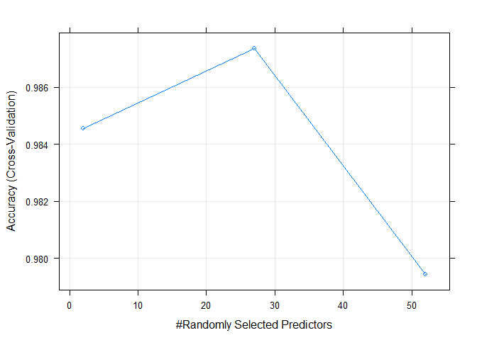

# Predict Quality of Excercise
Vineetha.Varghese  
July 9, 2016  
##Synopsis
In this project we will predict the quality of the barbell lifts performed by participants. Based on the training data we run 3 different models and find that Random Forest performs with the best accuracy (99%).

##Background

Using devices such as Jawbone Up, Nike FuelBand, and Fitbit it is now possible to collect a large amount of data about personal activity relatively inexpensively. These type of devices are part of the quantified self movement - a group of enthusiasts who take measurements about themselves regularly to improve their health, to find patterns in their behavior, or because they are tech geeks. One thing that people regularly do is quantify how much of a particular activity they do, but they rarely quantify how well they do it. In this project, your goal will be to use data from accelerometers on the belt, forearm, arm, and dumbell of 6 participants. They were asked to perform barbell lifts correctly and incorrectly in 5 different ways. More information is available from the website here: http://groupware.les.inf.puc-rio.br/har (see the section on the Weight Lifting Exercise Dataset).

## Load libraries

```r
#Load libraries needed for this script
library(ggplot2)
library(caret)
library(randomForest)
library(rpart)
library(gbm)
library(knitr)
```

##Data
The training data for this project are available here:
https://d396qusza40orc.cloudfront.net/predmachlearn/pml-training.csv

The test data are available here:
https://d396qusza40orc.cloudfront.net/predmachlearn/pml-testing.csv


```r
#Download training data
trainingFileURL <- "https://d396qusza40orc.cloudfront.net/predmachlearn/pml-training.csv?accessType = DOWNLOAD"
download.file(trainingFileURL, destfile="training.csv")

#Download testing data
testingFileURL <- "https://d396qusza40orc.cloudfront.net/predmachlearn/pml-testing.csv?accessType = DOWNLOAD"
download.file(testingFileURL, destfile="testing.csv")
```

##Loading and preprocessing the data
Read the csv file and store the data into variables, changing missing and empty spaves to 'NA' during the process.


```r
#Load the data to variables change all empty spaces to 'NA'
trainingActivity <- read.csv(file = "training.csv", header = TRUE, na.strings=c(""," ","NA"))
testingActivity <- read.csv(file = "testing.csv", header = TRUE, na.strings=c(""," ","NA"))
```

We will remove the columns that have any NA values. We will find on exploring the data that those columns have more that 90% NA thereby assuming their data will not have significant impact on 'classe'. Also remove the first 7 columns which do not have an impact on the 'classe' field.


```r
naCols <- sapply(names(trainingActivity), function(x) any(is.na(trainingActivity[,x]) == TRUE))
naColnames <- names(naCols)[naCols == FALSE]
finalColList <- naColnames[-(1:7)]
finalColList
```

```
##  [1] "roll_belt"            "pitch_belt"           "yaw_belt"            
##  [4] "total_accel_belt"     "gyros_belt_x"         "gyros_belt_y"        
##  [7] "gyros_belt_z"         "accel_belt_x"         "accel_belt_y"        
## [10] "accel_belt_z"         "magnet_belt_x"        "magnet_belt_y"       
## [13] "magnet_belt_z"        "roll_arm"             "pitch_arm"           
## [16] "yaw_arm"              "total_accel_arm"      "gyros_arm_x"         
## [19] "gyros_arm_y"          "gyros_arm_z"          "accel_arm_x"         
## [22] "accel_arm_y"          "accel_arm_z"          "magnet_arm_x"        
## [25] "magnet_arm_y"         "magnet_arm_z"         "roll_dumbbell"       
## [28] "pitch_dumbbell"       "yaw_dumbbell"         "total_accel_dumbbell"
## [31] "gyros_dumbbell_x"     "gyros_dumbbell_y"     "gyros_dumbbell_z"    
## [34] "accel_dumbbell_x"     "accel_dumbbell_y"     "accel_dumbbell_z"    
## [37] "magnet_dumbbell_x"    "magnet_dumbbell_y"    "magnet_dumbbell_z"   
## [40] "roll_forearm"         "pitch_forearm"        "yaw_forearm"         
## [43] "total_accel_forearm"  "gyros_forearm_x"      "gyros_forearm_y"     
## [46] "gyros_forearm_z"      "accel_forearm_x"      "accel_forearm_y"     
## [49] "accel_forearm_z"      "magnet_forearm_x"     "magnet_forearm_y"    
## [52] "magnet_forearm_z"     "classe"
```

```r
#Build the trainging dataset
trainingActivity <- trainingActivity[,finalColList]

#change the classe variable to a factor variable
trainingActivity$classe <- as.factor(trainingActivity$classe)
```

##Data Splitting and  3-fold Cross Validation
Split the training data to 60% training and 40% testing. We will use the testing set to do our own validation on how accurate the model we finally choose is.


```r
dim(trainingActivity)
```

```
## [1] 19622    53
```

```r
inTrain <- createDataPartition(y=trainingActivity$classe,
                               p=0.6, list=FALSE)
training <- trainingActivity[inTrain,]
testing <- trainingActivity[-inTrain,]
dim(training)
```

```
## [1] 11776    53
```

```r
dim(testing)
```

```
## [1] 7846   53
```

Here we will do a 3 fold cross validation.


```r
train_control <- trainControl(method='cv', number=3)
```

Set seed for reproducibility.


```r
set.seed(29)
```

##Model Selection
We will run the training data against 3 models Recursive Partitioning and Regression Trees, Random Forest and  Generalized Boosted Regression Models.


```r
#Model Fit
mod_fit_rpart <- train(classe ~ ., data=training, method="rpart", trControl=train_control)
mod_fit_rf <- train(classe ~ ., data=training, method= "rf", trControl=train_control)
mod_fit_gbm <- train(classe ~ ., data=training, method= "gbm", verbose=F, trControl=train_control)
```

We will check with the training and testing data set to see which of the 3 models give the best fit.

**Recursive Partitioning and Regression Trees**

```r
confusionMatrix(predict(mod_fit_rpart), training$classe)
```

```
## Confusion Matrix and Statistics
## 
##           Reference
## Prediction    A    B    C    D    E
##          A 3039  913  948  855  328
##          B   46  787   68  325  282
##          C  255  579 1038  750  578
##          D    0    0    0    0    0
##          E    8    0    0    0  977
## 
## Overall Statistics
##                                           
##                Accuracy : 0.496           
##                  95% CI : (0.4869, 0.5051)
##     No Information Rate : 0.2843          
##     P-Value [Acc > NIR] : < 2.2e-16       
##                                           
##                   Kappa : 0.3417          
##  Mcnemar's Test P-Value : NA              
## 
## Statistics by Class:
## 
##                      Class: A Class: B Class: C Class: D Class: E
## Sensitivity            0.9077  0.34533  0.50536   0.0000  0.45127
## Specificity            0.6388  0.92408  0.77762   1.0000  0.99917
## Pos Pred Value         0.4996  0.52188  0.32438      NaN  0.99188
## Neg Pred Value         0.9457  0.85469  0.88153   0.8361  0.88991
## Prevalence             0.2843  0.19353  0.17442   0.1639  0.18385
## Detection Rate         0.2581  0.06683  0.08815   0.0000  0.08297
## Detection Prevalence   0.5166  0.12806  0.27174   0.0000  0.08364
## Balanced Accuracy      0.7733  0.63470  0.64149   0.5000  0.72522
```

```r
testrpart <- confusionMatrix(predict(mod_fit_rpart, testing), testing$classe)
testrpart$overall['Accuracy'] 
```

```
## Accuracy 
## 0.495794
```

**Generalized Boosted Regression**

```r
traingbm <- confusionMatrix(predict(mod_fit_gbm), training$classe)
```

```
## Loading required package: plyr
```

```
## Warning: package 'plyr' was built under R version 3.2.3
```

```r
testgbm <- confusionMatrix(predict(mod_fit_gbm, testing), testing$classe)
testgbm$overall['Accuracy'] 
```

```
## Accuracy 
## 0.969921
```

**Random Forest**

```r
confusionMatrix(predict(mod_fit_rf), training$classe)
```

```
## Confusion Matrix and Statistics
## 
##           Reference
## Prediction    A    B    C    D    E
##          A 3348    0    0    0    0
##          B    0 2279    0    0    0
##          C    0    0 2054    0    0
##          D    0    0    0 1930    0
##          E    0    0    0    0 2165
## 
## Overall Statistics
##                                      
##                Accuracy : 1          
##                  95% CI : (0.9997, 1)
##     No Information Rate : 0.2843     
##     P-Value [Acc > NIR] : < 2.2e-16  
##                                      
##                   Kappa : 1          
##  Mcnemar's Test P-Value : NA         
## 
## Statistics by Class:
## 
##                      Class: A Class: B Class: C Class: D Class: E
## Sensitivity            1.0000   1.0000   1.0000   1.0000   1.0000
## Specificity            1.0000   1.0000   1.0000   1.0000   1.0000
## Pos Pred Value         1.0000   1.0000   1.0000   1.0000   1.0000
## Neg Pred Value         1.0000   1.0000   1.0000   1.0000   1.0000
## Prevalence             0.2843   0.1935   0.1744   0.1639   0.1838
## Detection Rate         0.2843   0.1935   0.1744   0.1639   0.1838
## Detection Prevalence   0.2843   0.1935   0.1744   0.1639   0.1838
## Balanced Accuracy      1.0000   1.0000   1.0000   1.0000   1.0000
```

```r
testrf <- confusionMatrix(predict(mod_fit_rf, testing), testing$classe)
testrf$overall['Accuracy'] 
```

```
##  Accuracy 
## 0.9963038
```

We see that the random forest model gives the best fit with an overall accuracy of 99.6303849% followed by Generalised Boosting Model gives an accuracy of 96.9920979%. Rpart is a poor fit with an accuracy of 49.5794035%.

*Random Forest testing details*


```r
testrf
```

```
## Confusion Matrix and Statistics
## 
##           Reference
## Prediction    A    B    C    D    E
##          A 2229    1    0    0    0
##          B    2 1512    3    1    2
##          C    1    4 1361    6    1
##          D    0    1    4 1276    0
##          E    0    0    0    3 1439
## 
## Overall Statistics
##                                           
##                Accuracy : 0.9963          
##                  95% CI : (0.9947, 0.9975)
##     No Information Rate : 0.2845          
##     P-Value [Acc > NIR] : < 2.2e-16       
##                                           
##                   Kappa : 0.9953          
##  Mcnemar's Test P-Value : NA              
## 
## Statistics by Class:
## 
##                      Class: A Class: B Class: C Class: D Class: E
## Sensitivity            0.9987   0.9960   0.9949   0.9922   0.9979
## Specificity            0.9998   0.9987   0.9981   0.9992   0.9995
## Pos Pred Value         0.9996   0.9947   0.9913   0.9961   0.9979
## Neg Pred Value         0.9995   0.9991   0.9989   0.9985   0.9995
## Prevalence             0.2845   0.1935   0.1744   0.1639   0.1838
## Detection Rate         0.2841   0.1927   0.1735   0.1626   0.1834
## Detection Prevalence   0.2842   0.1937   0.1750   0.1633   0.1838
## Balanced Accuracy      0.9992   0.9974   0.9965   0.9957   0.9987
```

Hence we select **Random Forest** as our prediction model.

#Out of Sample Error



```r
testPred <- predict(mod_fit_rf, testing)
OOSAccr <- sum(testPred == testing$classe)/length(testPred)
1- OOSAccr
```

```
## [1] 0.003696151
```

We get the accuracy from numberof predictions we got right divided by the number of predictions on our test sample. The out of sample error is 0.3696151%. 

##Prediction
We will now run our chosen random forest model against the test data provided.


```r
pred <- predict(mod_fit_rf, testingActivity)
pred
```

```
##  [1] B A B A A E D B A A B C B A E E A B B B
## Levels: A B C D E
```

##Conclusion
Based on the Random forest model in this instance we get a near perfect 99.6303849 accurate prediction.

